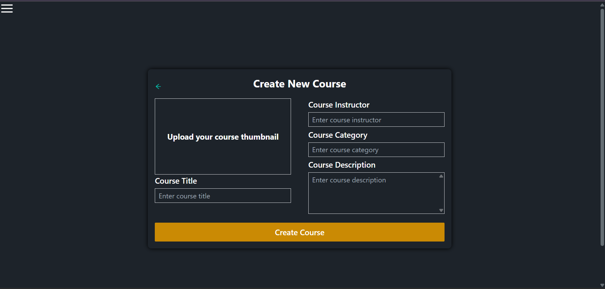

# 📚 Learning Management System (LMS)

A full-stack **Learning Management System (LMS)** built with the **MERN stack**, featuring secure authentication, role-based access, course management, Stripe payment integration, and an admin dashboard.  
This platform enables smooth online learning with course subscriptions, lecture management, and user profile customization.

---

## 🔗 Live Demo
👉 [Live Demo Here](https://your-deployed-link.com) *(replace with your deployed link)*

---

## ✨ Features

- 🔑 **Authentication & Security**
  - Login, Signup, Logout  
  - JWT-based authentication  
  - Role-based access (Admin / Subscriber)  

- 🎓 **Course Management**
  - Create & Delete Courses (Admin only)  
  - Add & Remove Lectures  
  - View Lectures (Subscribers only)  

- 👤 **User Management**
  - Edit Profile & Change Password  
  - Subscription with **Stripe payment integration**  
  - Cancel Subscription  

- 📊 **Admin Dashboard**
  - Manage Users  
  - Track Subscriptions  
  - Manage Courses & Lectures  

---

## 🛠 Tech Stack

- **Frontend:** React, Redux Toolkit, Tailwind CSS  
- **Backend:** Node.js, Express.js  
- **Database:** MongoDB (Mongoose ORM)  
- **Authentication:** JWT, bcrypt  
- **Payments:** Stripe API  
- **Deployment:** Vercel (Frontend), Render/Heroku (Backend), MongoDB Atlas  

---

## 🚀 Installation & Setup

### Prerequisites
- Node.js >= 16.x  
- MongoDB Atlas account  
- Stripe account  

### Steps
1. Clone the repository:
   ```bash
   git clone https://github.com/your-username/lms.git
   cd lms

## Install dependencies:

npm install
cd client && npm install


## Create a .env file in the root and add:

NODE_ENV = development

PORT = 5014

MONGO_URI = 

JWT_SECRET = 
JWT_EXPIRY = 

CLOUDINARY_CLOUD_NAME = 
CLOUDINARY_API_KEY = 
CLOUDINARY_API_SECRET =

SMTP_HOST = 
SMTP_PORT = 
SMTP_USERNAME = 
SMTP_PASSWORD = 
SMTP_FROM_EMAIL = 


FRONTEND_URL = 

CONTACT_US_EMAIL = 

STRIPE_PUBLISHABLE_KEY = 
STRIPE_SECRET_KEY = 
STRIPE_PRICE_ID =


## Run the backend & frontend:

(# In one terminal)
cd server
npm run server

(# In another terminal)
cd client
npm start


## 📸 Screenshots:-

### 🏠 Landing Page


### 🔐 Authentication


### 🎓 Course Management




### 📺 Lecture Management


### 👤 User Profile


### 💳 Subscription & Payments


### 📊 Admin Dashboard


### ❌ Error / Not Found

